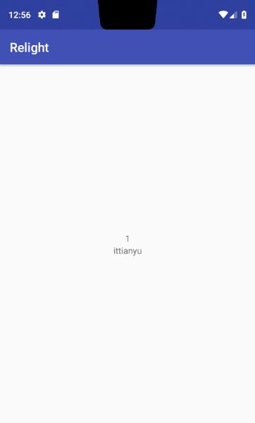

## 目的 ##
目的：学习 FrameWidget 的简单用法。

## 内容 ##
往 FrameWidget 中加入 2 个 TextWidget。

## 简介 ##
FrameWidget 是对 FrameLayout 的封装。 用于包容其他 Widget。

## 效果 ##
在中间显示 id 和 name。
点击屏幕后，触发刷新数据。




## 准备 ##

复制入门教程3的中2个类 `WidgetActivity` 和 `StatefulUserWidget`

## StatefulUserWidget ##

将泛型换成 Frame
```
LifecycleStatefulWidget<FrameLayout, FrameWidget>
```

#### createState ####

在上一节的基础，把 LinearWidget 改成 FrameWidget。

```
    private TextWidget twId;
    private TextWidget twName;

    @Override
    protected AsyncState<FrameWidget> createState(Context context) {
        twId = new TextWidget(context, lifecycle);
        twName = new TextWidget(context, lifecycle);
        FrameWidget root = new FrameWidget(context, lifecycle, twId, twName);
        return StateUtils.create(root);
    }
```

#### initWidget ####

设置 FrameWidget 宽高。
设置 twId twName 的布局位置，并给 twName 设置一个 marginTop 20.0 dp

```
    @Override
    public void initWidget(FrameWidget widget) {
        twId.layoutGravity(Gravity.CENTER);
        twName.layoutGravity(Gravity.CENTER)
                .marginTop(20.f);

        widget
                .matchParent()
                .onClickListener(v -> setState(() -> {
                    user = UserDataSource.getInstance().getUser();
                }));

        updateWidget(widget);
    }
```

#### updateWidget ####

把 ui 和 data 关联起来。

```
    @Override
    public void updateWidget(LinearWidget widget) {
        twId.text(user.getId() + "");
        twName.text(user.getName());
    }
```

## 总结 ##

这里简单介绍了 FrameWidget 的用法。 总体和上一节类似。

到这里为止，只介绍了第一种设置属性的办法，下一节，将会介绍另外一种设置属性的方式。

