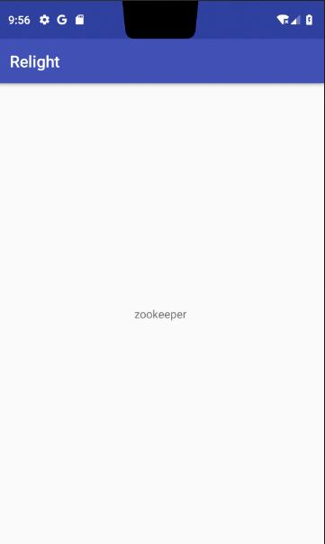

## 目的 ##
目的：学习 TextWidget 的简单用法，熟悉非 xml 的方式写界面。

## 内容 ##
把上一步的 state 中传入的 widget 改成 自己 new 的 TextWidget，在 initWidget 进行基本属性的设置。

## 简介 ##
UI复用一直是个令人头疼的问题，xml 的方式虽然将代码和视图分离开，使得可以实时预览界面，但这样也带来了局限性，只能在 xml 中设置一些简单的属性，和代码不能很好的结合起来，另外资源重名覆盖也是个头疼的问题，比如用了一个第三方库，里面写了一个 xml 和你项目的同名，则会出现覆盖问题。
用 java 代码写界面能解决上面的问题，但显得非常繁琐，且不能实时预览效果，对个人空间想象能力要求较高。但在代码里写界面已经不是什么新鲜事，非常幸运有第三方已经在这方面迈出了一步，那就是 [anko](https://github.com/Kotlin/anko)，配合插件可以实现实时预览。
本框架目前已提供一个 `WidgetView` ， 支持嵌入 xml 达到一定程度上预览的效果。


## 效果 ##
在中间显示 name。
点击屏幕后，触发刷新数据。




## 准备 ##

复制上一篇的中2个类 `WidgetActivity` 和 `StatefulUserWidget`

## StatefulUserWidget ##

#### createState ####
直接在上一篇的基础上进行修改，把之前的 `UserWidget` 换成本框架封装好的 `TextWidget`。

```
    @Override
    protected State<TextWidget> createState(Context context) {
        return StateUtils.create(new TextWidget(context, lifecycle));
    }
```

这个时候，因为泛型，会报错，所以，还得把泛型一起修改了
```
public class StatefulUserWidget extends StatefulWidget<TextView, TextWidget> {
...
}
```

#### initWidget ####

在上一篇中，UserWidget 的样式我们是在 xml 中定义好了，所以直接在这里设置事件就可以了。
而这一篇中，我们采用在代码中写界面的方式，所以修改样式的工作落到了这里。
整体效果很简单，让 text 全屏居中，并设置一个点击事件。代码其实并不比 xml 复杂多少，只是不能实时预览效果。
这里需要注意的是，公共属性可以爽快的使用链式api。（至于为什么设计成链式？原谅我用过 `scala` 之后停不下来了）

```
    @Override
    public void initWidget(TextWidget widget) {
        widget
                .text(user.getName())
                .gravity(Gravity.CENTER)
                .matchParent()
                .onClickListener(v -> setState(() -> {
                    user = UserDataSource.getInstance().getUser();
                }));
    }
```

#### update ####

这里直接把 name 设置给 text。

```
    @Override
    public void update() {
        super.update();
        widget.text(user.getName());
    }
```

## 总结 ##

这里简单介绍了 TextWidget 的用法。
目的是为了让你熟悉非 xml 方式的写法。

到这里为止，略微显示出了UI复用的优势，后面还有更多强大的功能，期待你能继续看下去。

