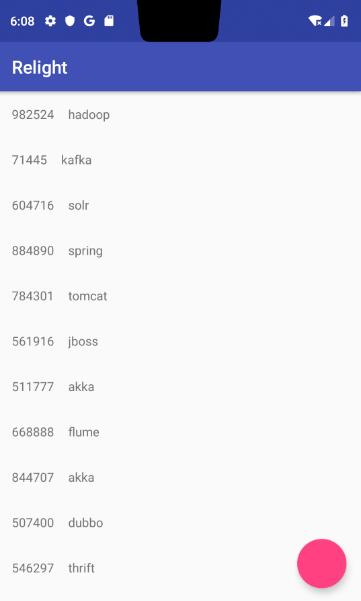

## 目的 ##
目的：学习 RmWidget 的使用。

## 内容 ##
在第一节 LceeWidget 基础上，组合 RmWidget 实现 LceermWidget 的效果。

## 简介 ##
虽然提供了 Lceerm，但考虑到一部分开发者倾向于更清晰的结构层次，又或者有些地方并不需要 lcee 的状态，只要 rm。 所以单独提供了一个 RmWidget。

## 效果 ##
和上一节相同




## 准备 ##

复制第一节的两个类 `UserLceeWidget`、 `WidgetActivity`

## UserRmWidget ##
新建 `UserRmWidget` 继承 `RmWidget`

```
public class UserRmWidget extends RmWidget<FrameLayout, FrameWidget> {
...
}
```

要实现 `build`、 `onRefreshing`、 `onRefreshContent`、 `onRefreshEmpty`、 `onRefreshError`、 `onRefreshComplete`、 `onLoadingMore`、 `onLoadMoreContent`、 `onLoadMoreEmpty`、 `onLoadMoreError`、 `onLoadMoreComplete`、 `onLoadData`、 `onLoadMore`
on 系列的方法和上一篇的几乎一样。

这里先介绍几个比较重要的方法

#### build ####

实际上就是创建了一个 `SwipeRefreshWidget`

```
	private SwipeRefreshWidget srw;
    private SwipeRefreshLayout.OnRefreshListener refresh = () -> {
        if (!refresh()) {
            srw.refreshing(false);
        }
    };

    @Override
    protected FrameWidget build(Context context) {
        srw = new SwipeRefreshWidget(context, lifecycle,
            renderRecycler()
        ).matchParent();
        return new FrameWidget(context, lifecycle,
            srw,
            renderFab()
        );
    }

    @Override
    public void initWidget(SwipeRefreshWidget widget) {
        widget.onRefreshListener(refresh).matchParent();
    }
```

#### onLoadData onLoadMore ####

加载数据和上一节类似，但返回的是 `RmStatus`

```
    @Override
    public RmStatus onLoadData() throws Exception {
        noMoreData = false;
        data = UserDataSource.getInstance().getUsersFromRemote();
        if (data.isEmpty())
            return RmStatus.RefreshEmpty;
        return RmStatus.RefreshContent;
    }

    @Override
    protected RmStatus onLoadMore() throws Exception {
        data = UserDataSource.getInstance().getUsersFromRemote();
        if (data.isEmpty()) {
            noMoreData = true;
            return RmStatus.LoadMoreEmpty;
        }
        return RmStatus.LoadMoreContent;
    }
```

#### 加载更多 ####

加载更多也和上一节几乎一样，唯一不同是 update 时的 status 不一样。
```
    private RecyclerWidget renderRecycler() {
        return new RecyclerWidget<UserItemAdapter>(context, lifecycle) {
            @Override
            protected void initProps() {
                width = matchParent;
                height = matchParent;
                layoutManager = new LinearLayoutManager(context);
                adapter = new UserItemAdapter(lifecycle);

                // load more
                view.addOnScrollListener(new RecyclerView.OnScrollListener() {
                    private int mLastVisibleItemPosition;
                    @Override
                    public void onScrollStateChanged(RecyclerView recyclerView, int newState) {
                        if (adapter == null || noMoreData || isLoading())
                            return;
                        RecyclerView.LayoutManager layoutManager = recyclerView.getLayoutManager();
                        if (layoutManager instanceof LinearLayoutManager) {
                            mLastVisibleItemPosition = ((LinearLayoutManager) layoutManager).findLastVisibleItemPosition();
                        }
                        if (newState == RecyclerView.SCROLL_STATE_IDLE
                                && mLastVisibleItemPosition + 1 == adapter.getItemCount()) {
                            loadMore();
                        }
                    }
                });
            }

            @Override
            public void update() {
                super.update();
                if (status == RmStatus.RefreshContent) {
                    adapter.setData(data);
                } else if (status == RmStatus.LoadMoreContent) {
                    adapter.addData(data);
                }
            }
        };
    }
```

## UserLceeWidget ##

上面只是一个 Content 的内容，里面是一个 list，带有刷新和加载更多的功能。
下面要把另外三种状态也加进来，这个时候要用到 LceeWidget。

新建一个 `UserLceeWidget`，由于比较简单，直接贴出全部代码。

```
public class UserLceeWidget extends LceeWidget {
    private View.OnClickListener reload = v -> reload();
    private UserRmWidget contentWidget;

    public UserLceeWidget(Context context, Lifecycle lifecycle) {
        super(context, lifecycle);
        // 为了在 onLoadData 中调用 contentWidget， 需要放在构造方法里执行，
        // 否则只有当加载完数据之后才会 调用 renderContent 进行初始化
        contentWidget = new UserRmWidget(context, lifecycle)
                .onReloadListener(reload)
                .showEmpty(this::showEmpty);
    }

    @Override
    protected Widget renderLoading() {
        return new CommonLoadingWidget(context, lifecycle);
    }

    @Override
    protected Widget renderContent() {
        return contentWidget;
    }

    @Override
    protected Widget renderEmpty() {
        return new CommonEmptyWidget(context, lifecycle, "No data. Click to reload", reload);
    }

    @Override
    protected Widget renderError() {
        lastError.printStackTrace();
        return new CommonEmptyWidget(context, lifecycle, "Network error. Click to reload", reload);
    }

    @Override
    protected LceeStatus onLoadData() throws Exception {
        RmStatus status = contentWidget.onLoadData();
        if (status == RmStatus.RefreshContent) {
            contentWidget.showRefreshContent();
        }
        return status.toLceeStatus();
    }

}
```

唯一需要注意的地方是 `onLoadData`
实际上，第一次加载数据 和 刷新数据应该是一样的，这里完全可以重新写一次请求，但如果能复用 RmWidget 里面的刷新逻辑就好了。

实际上是确实行得通。
我们直接调用 `RmStatus status = contentWidget.onLoadData();`
能拿到 RmStatus，然后把 RmStatus 转成 LceeStatus，作为外面的 onLoadData 的返回值。

但你会发现，这里还有3行代码。 为什么要判断刷新状态呢？ 实际上本来是没必要的，但由于 content 内部有一个 fab 按钮，点击后触发重新加载，而重新加载的逻辑都在 lcee 里面，也就是我们看到的这个方法，所以必须在这里来控制里面的内容。
```
	if (status == RmStatus.RefreshContent) {
	    contentWidget.showRefreshContent();
	}
```

#### reload ####

触发 reload 是在 fab 里面设置的，这里实际就是设置了一个点击事件，那么这个 reloadListener 是在哪里设置的呢？

```
    private BaseAndroidWidget renderFab() {
        fabWidget = new FloatingActionButtonWidget(context, lifecycle)
            .wrapContent()
            .layoutGravity(Gravity.END | Gravity.BOTTOM)
            .margin(16.f)
            .onClick(reloadListener);
        return fabWidget;
    }
```

当然是外面了，在 `UserLceeWidget` 构造方法中，创建了 `UserRmWidget`，并设置了 `onReloadListener`，这样，里面点击按钮就可以实现调用外面的 reload 逻辑了。
```
    public UserLceeWidget(Context context, Lifecycle lifecycle) {
        super(context, lifecycle);
        // 为了在 onLoadData 中调用 contentWidget， 需要放在构造方法里执行，
        // 否则只有当加载完数据之后才会 调用 renderContent 进行初始化
        contentWidget = new UserRmWidget(context, lifecycle)
                .onReloadListener(reload)
                .showEmpty(this::showEmpty);
    }
```


## 总结 ##

与上一节相比，这里实现略微曲线了一点，就是进行了委托，来实现逻辑复用。
